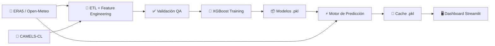

<div align="center">
  
  <h1>SIPI AI</h1>
  <p><strong>Sistema Inteligente de Predicción de Inundaciones a Nivel Nacional</strong></p>

  [](#)
  [](#)
  [](#)
  [](#)
</div>

<hr/>

## 📋 Descripción del Proyecto

**SIPI AI** es un sistema de inteligencia artificial diseñado para emitir alertas tempranas de crecidas fluviales en **392 cuencas hidrográficas de Chile**, otorgando hasta **48 horas de margen de reacción** frente a eventos climáticos extremos.

El sistema combina datos meteorológicos satelitales históricos (ERA5 vía Open-Meteo), registros hidrométricos oficiales (CAMELS-CL) y modelos de Machine Learning (XGBoost) para predecir tanto el caudal futuro de los ríos (en m³/s) como la probabilidad de desborde, presentando los resultados en un dashboard interactivo construido con Streamlit.

### 🔬 Pregunta de Análisis

> *¿Es posible predecir crecidas fluviales en ríos de Chile con 24 a 48 horas de anticipación utilizando exclusivamente datos meteorológicos satelitales (ERA5) y registros hidrométricos históricos (CAMELS-CL) como insumos de modelos XGBoost?*

## 📊 Datasets Utilizados

| Dataset | Fuente | Descripción |
| :--- | :--- | :--- |
| **CAMELS-CL** | [CR2 / DGA (Chile)](https://camels.cr2.cl/) | Registros diarios de caudal (m³/s) de 516 estaciones fluviométricas + atributos de cuenca (área, elevación, coordenadas). Período: 1940–2020. |
| **ERA5 (Open-Meteo Archive)** | [Open-Meteo](https://open-meteo.com/) | Reanálisis climático satelital global: precipitación, temperatura, humedad del suelo, nieve, radiación solar, viento. Resolución diaria por coordenada GPS. |
| **Pronóstico en Tiempo Real** | [Open-Meteo Forecast](https://open-meteo.com/) | Pronóstico meteorológico a 3 días para generar las predicciones en vivo del dashboard. |
| **DGA Telemetría** | [DGA/MOP (Chile)](https://snia.mop.gob.cl/) | Datos de caudal en tiempo real desde estaciones telemáticas gubernamentales (cuando están disponibles). |

## 🚀 Características Principales

* 📡 **Monitoreo Nacional Masivo**: Cobertura de 392 estaciones fluviométricas a lo largo de 16 regiones de Chile.
* 🧠 **Pipeline de ML con XGBoost**: Modelos de Gradient Boosting con árboles de decisión — un Regresor para predecir el caudal exacto (m³/s) y un Clasificador para estimar la probabilidad de crecida (Percentil 95).
* ⚡ **Arquitectura de Baja Latencia**: Frontend en Streamlit que lee cachés serializados en memoria RAM para renderizar la topografía nacional sin bloqueos.
* 🏔️ **Sensores Virtuales Cordilleranos**: Algoritmo de *offset* espacial para monitorear radiometría y lluvia directamente en altas cumbres, adelantándose al deshielo.
* 🔍 **Inteligencia Artificial Explicable (XAI)**: Filtros SHAP que traducen las decisiones del modelo a lenguaje humano (ej. *"Saturación del Suelo"* o *"Lluvia cálida sobre nieve"*).
* 🛡️ **Filtro Anti-Alucinaciones**: Heurística de sentido común que invalida predicciones de crecida cuando no hay evidencia meteorológica que las sustente.

## 🔑 Hallazgos Principales

Tras entrenar y evaluar modelos para 392 estaciones a nivel nacional, los resultados muestran que:

| Métrica | Valor Nacional (Mediana) | Interpretación |
| :--- | :---: | :--- |
| **NSE (Nash-Sutcliffe)** | **0.810** | 🟢 Excelente — El modelo explica el 81% de la variabilidad del caudal |
| **R² (Determinación)** | **0.810** | 🟢 Excelente — Alta correlación entre predicho y observado |
| **ROC-AUC (Crecidas P95)** | **0.917** | 🟢 Alta Precisión — Detecta el 91.7% de las crecidas extremas |

**Distribución de calidad de los modelos:**
- 🟢 **59.6%** de las estaciones con rendimiento Excelente (NSE > 0.75)
- 🔵 **17.2%** con rendimiento Bueno (0.5 < NSE ≤ 0.75)
- 🟡 **12.0%** con rendimiento Moderado (0 < NSE ≤ 0.5)
- 🔴 **11.3%** con rendimiento Deficiente (NSE ≤ 0) — principalmente ríos hiperáridos del norte

> **Conclusión**: Sí es posible predecir crecidas fluviales con XGBoost y datos satelitales con alta precisión en la mayoría de las cuencas de Chile. Las estaciones con rendimiento deficiente corresponden principalmente a cauces de régimen nival extremo o ríos intermitentes del desierto de Atacama.

## 🧩 Arquitectura del Sistema

El ecosistema opera mediante una estructura **desacoplada y asíncrona**, dividida en procesos offline de entrenamiento, inferencia en segundo plano y visualización táctica.



### Inventario de Módulos

| Script | Función |
| :--- | :--- |
| `procesar_todo_chile_desatendido.py` | **Orquestador Maestro.** Itera sobre las 516 estaciones de CAMELS-CL, extrae datos, genera datasets y entrena todos los modelos de forma desatendida. |
| `procesar_cuenca_desatendido.py` | **ETL.** Descarga el clima histórico de Open-Meteo ERA5, lo cruza con el registro CAMELS-CL y realiza Feature Engineering (lags, acumulados, isoterma cero). |
| `validar_dataset_generico.py` | **Quality Assurance.** Audita integridad de datos: volumen mínimo, columnas obligatorias, tolerancia de nulos y control de varianza. |
| `entrenar_modelo_gpu.py` | **Motor de Entrenamiento.** Entrena los modelos XGBoost (Regresor + Clasificador) y exporta los pesos serializados `.pkl`. |
| `evaluar_rendimiento_nacional.py` | **Auditoría.** Calcula métricas de precisión (NSE, R², RMSE, ROC-AUC) en datos Out-of-Sample a nivel nacional. |
| `motor_prediccion.py` | **Cerebro Online.** Cron Job que descarga el pronóstico meteorológico en tiempo real y genera la caché de predicciones (`cache_predicciones.pkl`). |
| `dga_api.py` | **Integración DGA.** Consulta los servidores de telemetría de la Dirección General de Aguas para obtener caudales en vivo. |
| `app.py` | **Dashboard.** Frontend Streamlit con mapa interactivo nacional, KPIs, gráficos de series temporales y sistema de alertas. |

## 📂 Estructura de Directorios

```text
Predicciones_innundaciones/
├── datos_entrenamiento/              # CSVs históricos combinados (CAMELS + ERA5) [gitignored]
├── modelos_entrenados/               # Pesos serializados .pkl de los modelos IA [gitignored]
├── CAMELS_CL_v202201/                # Inventario Oficial Nacional (DGA/CR2) [gitignored]
├── app.py                            # Dashboard Streamlit (Frontend)
├── motor_prediccion.py               # Motor de predicción en tiempo real (Backend)
├── entrenar_modelo_gpu.py            # Entrenamiento de modelos XGBoost
├── evaluar_rendimiento_nacional.py   # Evaluación de métricas nacionales
├── procesar_todo_chile_desatendido.py  # Orquestador del pipeline completo
├── procesar_cuenca_desatendido.py    # ETL por cuenca individual
├── validar_dataset_generico.py       # Validación de calidad de datos
├── dga_api.py                        # Integración con telemetría DGA
├── analisis_sipi.ipynb               # Notebook con análisis documentado
├── puntos_por_estacion.json          # Coordenadas GPS de estaciones
├── requirements.txt                  # Dependencias del proyecto
├── .gitignore
└── README.md
```

## 🛠️ Instalación y Despliegue

### 1. Clonar el repositorio y configurar el entorno

```bash
git clone https://github.com/Paimilla/SIPI-sistema-de-prediccion-de-inundaciones.git
cd SIPI-sistema-de-prediccion-de-inundaciones
pip install -r requirements.txt
```

### 2. Generar Caché de Inferencias (Backend)

Antes de abrir la interfaz gráfica, el motor predictivo debe descargar el pronóstico meteorológico de los próximos 3 días y aplicar los modelos XGBoost:

```bash
python motor_prediccion.py
```

> *Este proceso genera el archivo `cache_predicciones.pkl` en la raíz del proyecto. En producción, este comando debe programarse como un Cron Job para ejecutarse cada 12 horas.*

### 3. Levantar el Dashboard (Frontend)

```bash
streamlit run app.py
```

## 🌐 Aplicación Publicada

<!-- TODO: Reemplazar con la URL real al publicar en Streamlit Cloud -->
🔗 **URL**: *https://sic2026c-pcohort2-cfcjentye7habtrqdqyl63.streamlit.app/*

## 🛡️ Filtro Anti-Alucinaciones (Heurística de Sensatez)

Los modelos puros de ML pueden generar falsos positivos bajo condiciones climáticas anómalas. SIPI integra un filtro heurístico riguroso:

```python
# Si el modelo predice crecida pero no hay evidencia de lluvia → invalidar predicción
if caudal_predicho > umbral_p95 * 0.6 and lluvia_acumulada_3d < 15.0:
    caudal_predicho = mediana_historica * 1.05  # Forzar calma
    probabilidad_desborde = 0.01                # Reducir a 1%
```

## 📚 Créditos y Atribuciones

- **CAMELS-CL**: Álvarez-Garretón, C. et al. (2018). *The CAMELS-CL dataset*. Centro de Ciencia del Clima y la Resiliencia (CR2), Universidad de Chile.
- **Open-Meteo**: API meteorológica libre basada en reanálisis ERA5 del ECMWF.
- **DGA Chile**: Dirección General de Aguas, Ministerio de Obras Públicas.

## 👥 Integrantes — Equipo 7

| Nombre | Rol |
| :--- | :--- |
| Carolina Pino | Integrante |
| Felipe Paimilla | Integrante |
| Débora Cáceres | Integrante |
| Bastián Figueroa | Integrante |

---

<div align="center">
  <b>Desarrollado para resolver desafíos críticos de adaptación climática en Chile 🇨🇱</b>
</div>
